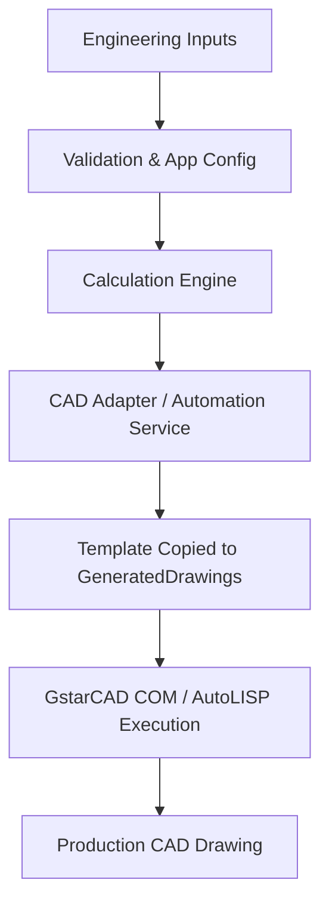
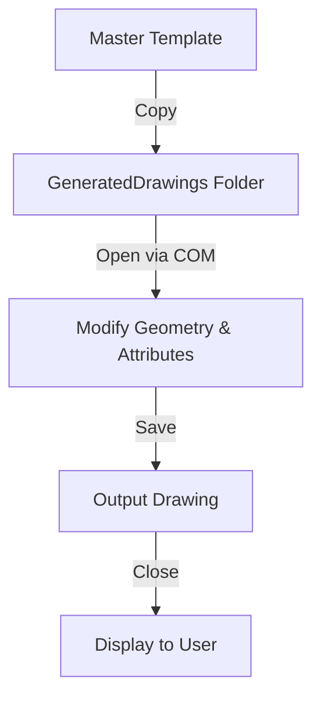

<div align="center">

# MEGA Engineering Suite

**Professional CAD Automation Software**

Generate production-ready engineering drawings directly from engineering parameters using C#, AutoLISP, and GstarCAD automation.

<br>

[](#)
[](#)
[](#)
[](#)
[](#)
[](#)
[](#)
[](#)

<br>

<p align="center">
  
</p>

</div>

## Overview

Industrial equipment design traditionally relies on manual CAD drafting, a process that is time-consuming, prone to human error, and difficult to standardize across engineering teams. Generating accurate layouts for tube sheets and baffles requires precise geometric calculations and iterative positioning.

MEGA Engineering Suite addresses this engineering problem by replacing manual drafting with programmatic generation. By entering strict engineering parameters into the suite, the application computes the required geometry, resolves spatial constraints, and generates deterministic output. These scripts and COM instructions directly interface with GstarCAD to output standardized, production-ready engineering drawings in seconds. The modular architecture ensures that new equipment types and layout variations can be seamlessly integrated into the existing workflow.

---

## Features

| Feature | Description |
| --- | --- |
| Parametric CAD Generation | Automatically generates drawings from engineering parameters |
| Standardized Document Lifecycle | Immutable master templates with automated drafting copies |
| COM Automation | Direct manipulation of CAD entities and title blocks |
| Modular Architecture | Flat, scalable structure supporting independent modules |
| Self-Healing Validation | Startup validations to ensure required templates exist |

---

## Modules

### TubeSheet Module

| Capability | Status |
| --- | --- |
| Front / Rear Tube Sheet | Complete |
| Tube Layout & Bolt Holes | Complete |
| Partition Plates & Side Views | Complete |
| Dimensioning & Annotations | Complete |
| Bonnet Flange Integration | Complete |
| LISP Generation Engine | Complete |

### Flange Module (Bonnet)

| Capability | Status |
| --- | --- |
| Dimensional Lookups | Complete |
| GstarCAD COM Automation | Complete |
| Title Block Extraction & Update | Complete |
| Isolated Template Pipeline | Complete |

---

## Architecture



---

## CAD Document Lifecycle

The suite adheres to a strict, standardized CAD document lifecycle to ensure templates remain uncorrupted and Administrator privileges are never required:



---

## Technology Stack

| Technology | Purpose |
| --- | --- |
| C# (.NET 10.0) | Core application, forms, and COM adapters |
| ClosedXML | Reading parameters from Excel datasets |
| GstarCAD COM API | Direct programmatic CAD drafting |
| AutoLISP | Batch geometric calculations in CAD |

---

## Repository Structure

The suite uses a flat, highly portable architecture ensuring it runs immediately upon cloning:

```text
MEGA Engineering Suite
│
├── MegaEngineeringSuite      # Core Application & Modules (C#)
│   ├── BonnetFlange          # Bonnet Flange generator & annotation engine
│   ├── TubeSheet             # Tube Sheet automation & geometry
│   ├── Infrastructure        # CAD Adapters, COM Sessions, & Logging
│   └── Config                # Configuration managers & validation
│
├── Templates                 # Immutable CAD (.dwg) & Excel (.xlsx) templates
│
├── GeneratedDrawings         # Output directory for finalized DWG files
│
├── GeneratedLisp             # Output directory for generated LISP scripts
│
├── Logs                      # System diagnostics and execution logs
│
├── Config                    # Application configuration (Settings.json)
│
├── Docs                      # Engineering Standards & Deployment Guides
│
└── TestConsole               # Headless COM testing utility
```

---

## Future Roadmap

| Module / Feature | Status |
| --- | --- |
| TubeSheet | Complete |
| Flange / Bonnet | Complete |
| Baffle | Planned |
| Nozzle | Planned |
| Pipe Support | Planned |
| Tank | Planned |
| BOM Generation | Planned |
| Multi-CAD Support | Planned |

---

## Documentation

| Document | Link |
| --- | --- |
| CAD Lifecycle Standard | [CAD_Document_Lifecycle_Standard.md](docs/CAD_Document_Lifecycle_Standard.md) |
| Deployment Guide | [Deployment_Guide.md](docs/Deployment_Guide.md) |

---

<div align="center">
  
**MEGA Engineering Suite**

Developed by **MEGA Engineering Projects Pvt. Ltd.**

Professional CAD Automation for Process Equipment Design

</div>
