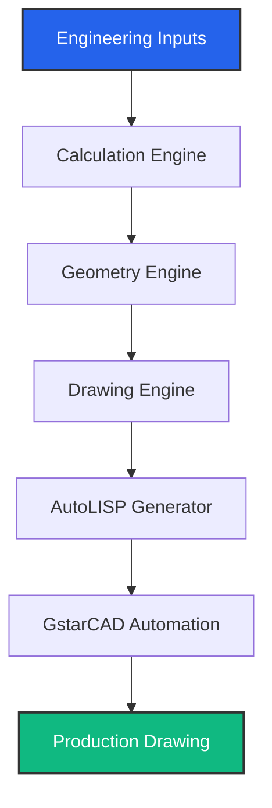

<div align="center">

# MEGA Engineering Suite

**Transforming engineering parameters into production-ready CAD drawings through intelligent automation.**

[](#)
[](#)
[](#)
[](#)
[](#)
[](#)
[](#)

<br/>

+----------------------------------------------------+
|                                                    |
|          MEGA Engineering Suite Screenshot         |
|                                                    |
|      (Future GIF / CAD animation placeholder)      |
|                                                    |
+----------------------------------------------------+
<br/>
*(Users can later replace this with a CAD Generation GIF, TubeSheet Automation GIF, or Drawing Generation Demo)*

</div>

<br/>

## 🏗 About MEGA Engineering Suite

The **MEGA Engineering Suite** is a professional CAD automation platform built specifically for industrial equipment design. By integrating advanced mathematical geometry, layout generation, and dynamic scripting, MEGA Engineering Suite translates raw engineering requirements into detailed, production-ready drafting.

Our mission is to eliminate manual drafting errors, standardize industrial drawing outputs, and dramatically accelerate the time from engineering design to manufacturing. 

<div align="center">
  
**🏗 Professional CAD Automation** &nbsp;|&nbsp;
**⚙ Engineering Calculations** &nbsp;|&nbsp;
**📐 Automatic Drawing Generation** &nbsp;|&nbsp;
**🤖 AutoLISP Automation** &nbsp;|&nbsp;
**🎯 GstarCAD Integration**

</div>

---

## ✨ Features

| 🚀 Feature | Description |
| :--- | :--- |
| **Parametric CAD** | Generate comprehensive drawings directly from strict engineering parameters. |
| **AutoLISP Engine** | Fully automated drafting routines bypassing manual CAD interventions. |
| **Template System** | Intelligent, anchor-based template positioning and alignment. |
| **Engineering Calculations** | Dynamic geometry generation for tube sheets, baffles, and layouts. |
| **CAD Integration** | Seamless and direct automation for GstarCAD and AutoCAD environments. |
| **Modular Design** | Extensible architecture allowing the easy addition of new equipment modules. |

---

## 🛠️ Modules

<details open>
<summary><b>📐 TubeSheet Module</b></summary>
<br/>

- ✔️ **Front Tube Sheet:** Intelligent rendering with dynamic boundaries.
- ✔️ **Rear Tube Sheet:** Symmetrical generation and validation.
- ✔️ **Tube Layout:** Automated, collision-free triangular and square pitch matrix generation.
- ✔️ **Bolt Holes:** Parametric PCD (Pitch Circle Diameter) calculation and hole distribution.
- ✔️ **Partition Plates:** Precise gasket seating and partition drafting.
- ✔️ **Side Views:** Sectional geometry generation with exact depth mappings.
- ✔️ **Dimensioning:** Auto-scaling offset dimension logic.
- ✔️ **Annotation Placement:** Collision-aware text and leader positioning.
- ✔️ **CAD Generation:** Fully-automated `.scr` and `.lsp` export.
</details>

<details open>
<summary><b>⚙️ Baffle Module</b></summary>
<br/>

- ✔️ **Top Cut Baffle:** Calculates structural support cuts seamlessly.
- ✔️ **Bottom Cut Baffle:** Fluid pathway bypass management.
- ✔️ **Dynamic Cut Geometry:** Mathematically precise chord length definitions.
- ✔️ **Tube Clearance:** Active collision-avoidance logic for tie-rods and baffles.
- ✔️ **Automatic Dimensions:** Dynamic geometric dimension offsets.
- ✔️ **Layer Management:** Industry-standard layer assignments.
- ✔️ **Leader Generation:** Responsive and mirroring text leaders.
- ✔️ **Annotation Engine:** Aesthetic textual callout system.
</details>

---

## 🔄 Workflow



---

## 🏛 Architecture

```text
┌────────────────────────────┐
│ Engineering Inputs         │
└────────────┬───────────────┘
             │
┌────────────▼───────────────┐
│ Calculation Engine         │
└────────────┬───────────────┘
             │
┌────────────▼───────────────┐
│ Geometry Engine            │
└────────────┬───────────────┘
             │
┌────────────▼───────────────┐
│ Drawing Engine             │
└────────────┬───────────────┘
             │
┌────────────▼───────────────┐
│ AutoLISP Generator         │
└────────────┬───────────────┘
             │
┌────────────▼───────────────┐
│ GstarCAD Automation        │
└────────────┬───────────────┘
             │
┌────────────▼───────────────┐
│ Production Drawing         │
└────────────────────────────┘
```

---

## 💻 Technology Stack

| Technology | Icon | Purpose |
| :--- | :---: | :--- |
| **C#** |  | Core Application Logic |
| **.NET** |  | Application Framework |
| **WinForms** |  | Desktop User Interface |
| **AutoLISP** |  | CAD Automation Scripts |
| **Python** |  | Utility Scripts & Patching |
| **GstarCAD** |  | Target CAD Platform |

---

## 📸 Screenshots

<details>
<summary><b>TubeSheet Module</b></summary>
<br/>

> *[Large screenshot placeholder]*
> *(Add image of TubeSheet generation here)*
</details>

<details>
<summary><b>Baffle Module</b></summary>
<br/>

> *[Large screenshot placeholder]*
> *(Add image of Baffle generation here)*
</details>

<details>
<summary><b>Side Views</b></summary>
<br/>

> *[Large screenshot placeholder]*
> *(Add image of Sectional side views here)*
</details>

<details>
<summary><b>Final Engineering Drawing</b></summary>
<br/>

> *[Large screenshot placeholder]*
> *(Add image of the final production drawing here)*
</details>

---

## 🗺️ Future Roadmap

- ✅ **TubeSheet Module** (Completed)
- ✅ **Baffle Module** (Completed)
- 🔄 **Flange Module**
- 🔄 **Nozzle Module**
- 🔄 **Pipe Support Module**
- 🔄 **Tank Module**
- 🔄 **BOM Generator**
- 🔄 **Report Generator**
- 🔄 **Multi-CAD Support**
- 🔄 **REST API**
- 🔄 **Cloud Drawing Management**

---

## 📊 Project Statistics

### Modules Completed
**40%** `████████░░░░░░░░░░`

**TubeSheet**&nbsp;&nbsp;&nbsp;&nbsp;&nbsp;&nbsp;`██████████` (100%)<br/>
**Baffle**&nbsp;&nbsp;&nbsp;&nbsp;&nbsp;&nbsp;&nbsp;&nbsp;&nbsp;&nbsp;&nbsp;&nbsp;&nbsp;`██████████` (100%)<br/>
**Flange**&nbsp;&nbsp;&nbsp;&nbsp;&nbsp;&nbsp;&nbsp;&nbsp;&nbsp;&nbsp;&nbsp;&nbsp;&nbsp;`░░░░░░░░░░` (0%)<br/>
**Tank**&nbsp;&nbsp;&nbsp;&nbsp;&nbsp;&nbsp;&nbsp;&nbsp;&nbsp;&nbsp;&nbsp;&nbsp;&nbsp;&nbsp;&nbsp;&nbsp;&nbsp;`░░░░░░░░░░` (0%)<br/>

---

## 📂 Folder Structure

```text
MEGA Engineering Suite
├── Calculation Engine
├── Geometry
├── Drawing Engine
├── AutoLISP
├── Templates
├── Modules
│   ├── TubeSheet
│   ├── Baffle
│   ├── Flange
│   └── Tank
└── Resources
```

---

<br/>

<div align="center">

Made with ❤️ by

**MEGA Engineering Projects Pvt. Ltd.**

*Engineering Automation • CAD Intelligence • Industrial Software*

</div>
