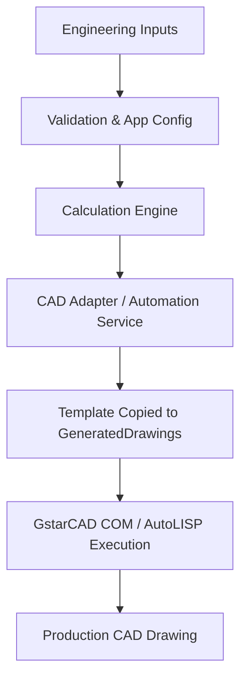

<div align="center">

# MEGA Engineering Suite

**Professional CAD Automation Software**

Generate production-ready engineering drawings directly from engineering parameters using C#, AutoLISP, and GstarCAD automation.

<br>

[](#)
[](#)
[](#)
[](#)
[](#)
[](#)
[](#)
[](#)

<br>

<p align="center">
  
</p>

</div>

## 📖 Overview

Industrial equipment design traditionally relies on manual CAD drafting, a process that is time-consuming, prone to human error, and difficult to standardize across engineering teams. Generating accurate layouts for tube sheets and baffles requires precise geometric calculations and iterative positioning.

MEGA Engineering Suite addresses this engineering problem by replacing manual drafting with programmatic generation. By entering strict engineering parameters into the suite, the application computes the required geometry, resolves spatial constraints, and generates deterministic output. These scripts and COM instructions directly interface with GstarCAD to output standardized, production-ready engineering drawings in seconds. The modular architecture ensures that new equipment types and layout variations can be seamlessly integrated into the existing workflow.

---

## ✨ Features

| Feature | Description |
| --- | --- |
| **Parametric CAD Generation** | Automatically generates deterministic drawings directly from engineering parameters. |
| **Immutable Template Management** | Adheres to a standard document lifecycle with master templates and isolated, automated drafting copies. |
| **COM Automation Engine** | Direct manipulation of CAD entities, drawing attributes, and title block integrations without manual intervention. |
| **Self-Healing Validations** | Startup checks ensure required configurations, templates, and runtime environments exist before execution. |
| **BOM and Annotations** | Fully automates Tube Sheet Bill of Materials generation and spatial annotations dynamically. |

---

## 🏗️ Architecture



The system uses a state-of-the-art Pipeline architecture, separating Discovery, Validation, and Replacement phases to ensure fault-tolerance and robustness when working with COM components.

---

## 🚀 Installation & Build Instructions

### Prerequisites
- .NET 10.0 SDK or higher
- GstarCAD 2023 or newer installed
- Windows 10/11

### Build from Source
1. Clone the repository:
   ```cmd
   git clone https://github.com/your-org/MegaEngineeringSuite.git
   ```
2. Navigate to the project directory:
   ```cmd
   cd MegaEngineeringSuite
   ```
3. Restore dependencies and build the solution:
   ```cmd
   dotnet restore
   dotnet build -c Release
   ```
4. Run the suite:
   ```cmd
   dotnet run --project MegaEngineeringSuite/MegaEngineeringSuite.csproj
   ```

---

## 🛠️ Technology Stack

* **Core Framework:** C# / .NET 10.0 (Windows Forms)
* **CAD Engine Integration:** GstarCAD Type Libraries (COM Interop)
* **Geometric Generation:** AutoLISP
* **Data Processing:** ClosedXML (Excel Integration)

---

## 🗺️ Roadmap

- [x] Tube Sheet Parametric Engine
- [x] GstarCAD COM Interactive/Automation Lifecycle
- [x] Title Block Synchronization
- [x] Bill of Materials (BOM) Automation
- [ ] Inno Setup Windows Installer
- [ ] Flange Module Expansion
- [ ] Tank & Nozzle Design Generation

---

## 📄 License

This software is licensed under a **Proprietary License** by MEGA EPC PVT LTD. All Rights Reserved. See the [LICENSE](LICENSE) file for details.
