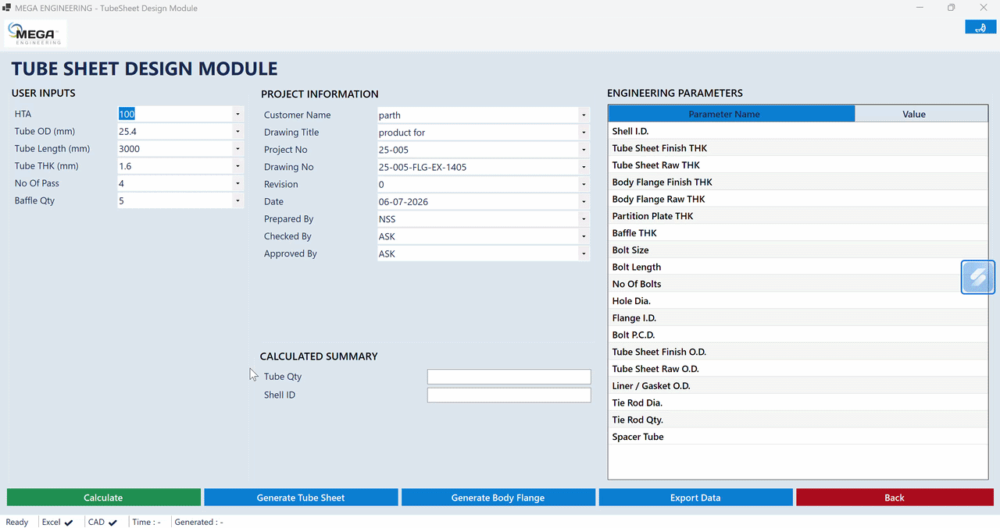
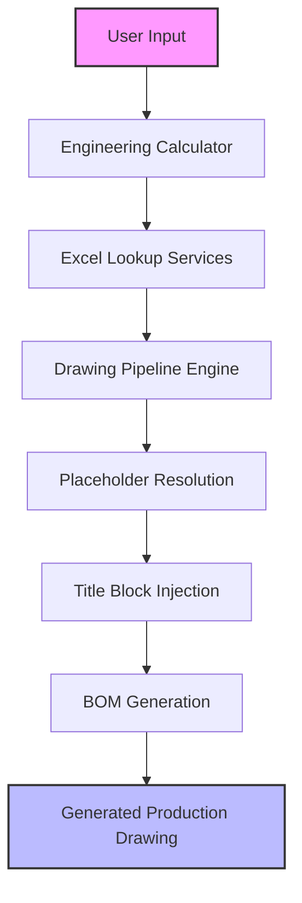
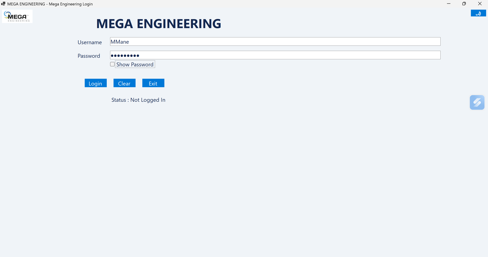
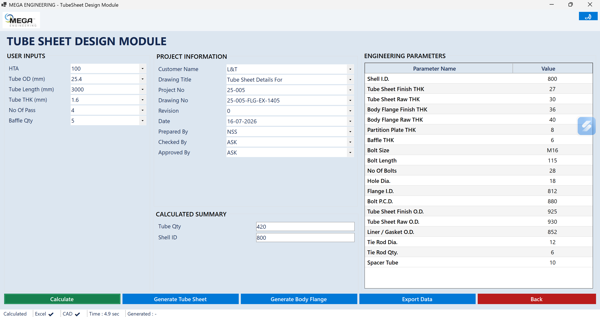
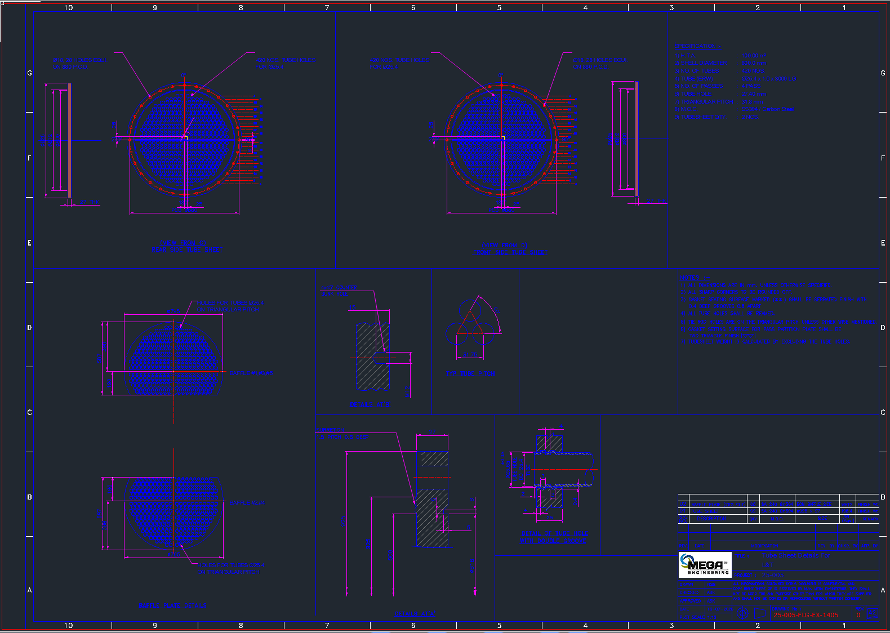
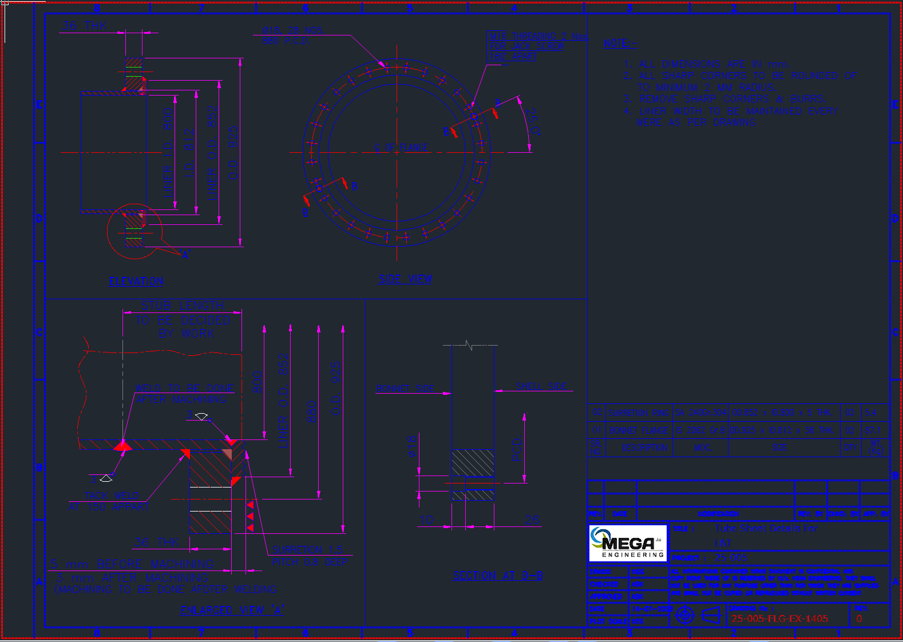

<div align="center">

# Mega Engineering Suite
**Professional Engineering Drawing Automation for GstarCAD**

*Transforming engineering parameters into production-ready CAD drawings instantly through powerful COM automation.*

**Version v1.2.2**

[](#)
[](#)
[](#)
[](#)
[](#)
[](#)

<br>
<p align="center">
  
</p>

<p align="center">
  <strong>Windows Desktop CAD Automation Suite for GstarCAD</strong><br>
  Generate Tube Sheet Drawings, BOMs, and Engineering Documentation in Seconds.
</p>

</div>

---

## 📖 Project Overview

**Mega Engineering Suite** is a state-of-the-art Windows desktop application designed to bridge the gap between mechanical engineering calculations and physical drafting. Built for mechanical engineers, designers, and draftsmen, the software eliminates repetitive manual CAD work by completely automating the creation of standardized, high-quality industrial drawings.

### The Engineering Workflow
In traditional engineering environments, designing industrial equipment like heat exchangers or pressure vessels involves complex calculations that are subsequently handed off to a drafter to reproduce manually in a CAD system. This gap introduces significant human error, bottleneck delays, and inconsistencies in drawing standards.

### The Solution
Mega Engineering Suite resolves this by binding directly to the GstarCAD COM API. Users simply input their verified engineering parameters, and the suite autonomously processes the spatial geometry, resolves drawing constraints, writes the Bill of Materials (BOM), updates the Title Block, and generates a finalized DWG—all within a matter of seconds.

**Benefits:**
- **Zero Drafting Errors:** Direct parameter-to-drawing translation.
- **Massive Time Savings:** Drawing generation reduced from hours to seconds.
- **Strict Standardization:** Enforces identical drafting styles and formatting universally.

---

## ✨ Core Features

| Capability | Description |
| --- | --- |
| **Tube Sheet Module** | Fully automated layout and geometric drafting of industrial tube sheets. |
| **Dynamic Placeholder Engine** | Advanced, fault-tolerant text replacement pipeline operating deep within CAD model space. |
| **Title Block Automation** | Programmatically populates engineering metadata, revision tracking, and approvals. |
| **BOM Generation** | Automatically calculates, aligns, and injects Bill of Material tables directly into the drawing. |
| **Excel Lookup Integration** | Reads standardized hardware dimensions and material properties dynamically from Excel data banks. |
| **GstarCAD COM Automation** | Native, ultra-low-latency interaction with the GstarCAD drafting engine. |
| **Interactive Generation** | Keeps the drawing instance alive and active for engineers to review the output in real-time. |
| **Professional Windows Installer** | Single-click Inno Setup deployment with automatic permission escalation and dependency validation. |

---

## 🏗️ Architecture

The application relies on a strictly deterministic, unidirectional data flow utilizing a decoupled pipeline architecture.



---

## 📸 Interface & Outputs

<div align="center">
  
**Home Dashboard**  


**Engineering Input Form**  


**Generated Tubesheet Drawing**  


**Generated Baffle Drawing**  


**Setup Installer**  


</div>

---

## 🚀 Installation & Deployment

Deploying the suite is fully automated via the provided Windows Installer.

1. **Download Installer:** Obtain `MegaEngineeringSuite_Setup_v1.2.2.exe` from the latest GitHub Release.
2. **Run Setup:** Execute the installer (requires Administrator privileges).
3. **Install Dependencies:**
   - Ensure **GstarCAD** is installed and activated.
   - Ensure the **.NET 10.0 Desktop Runtime** is installed.
4. **Launch:** Run *Mega Engineering Suite* from your Start Menu or Desktop shortcut.

---

## 🛠️ Technology Stack

| Technology | Purpose |
| --- | --- |
| **C# / .NET 10** | Core application logic and execution framework. |
| **WinForms** | Rapid, stable user interface development. |
| **GstarCAD COM API** | Direct CAD automation, entity manipulation, and rendering. |
| **ExcelDataReader** | High-speed, dependency-free Excel parsing for engineering tables. |
| **Inno Setup** | Professional, secure Windows deployment and uninstallation. |

---

## 📁 Repository Structure

```text
MegaEngineeringSuite/
├── MegaEngineeringSuite/            # Main C# Source Code
│   ├── BonnetFlange/                # Form & Module Logic
│   ├── Infrastructure/              # CAD Interfaces & COM Wrappers
│   ├── TubeSheet/                   # Core Generators & Calculators
│   └── Properties/                  # Application Metadata
├── Config/                          # External Settings JSON
├── Templates/                       # Master DWG & Excel Templates
├── installer/                       # Deployment configurations
│   ├── InnoSetup/                   # Setup.iss compilation script
│   └── Output/                      # Compiled setup executables
└── README.md                        # Documentation
```

---

## 📦 Modules

### Current Capabilities
- ✅ **Tube Sheet:** Full drafting, dimensioning, and annotation.

### Future Expansion
- ⏳ **Flange:** Standardized blind and slip-on flange generation.
- ⏳ **Nozzle:** Custom equipment nozzle sizing and placement.
- ⏳ **Pipe Support:** Structural pipe support and hanger detailing.
- ⏳ **Tank:** Pressure vessel and atmospheric tank profiling.
- ⏳ **Report Generator:** Automated PDF calculation summaries.

---

## 🗺️ Development Roadmap

**Completed:**
- [x] Base Application Architecture
- [x] Interactive Drawing Pipeline
- [x] Placeholder Resolution Engine
- [x] Automated BOM & Title Block
- [x] Professional Inno Setup Installer
- [x] Production Release (v1.2.2)
- [x] Master Diagnostics & Correlation ID Framework
- [x] [Full Chronological Development Timeline](docs/DEVELOPMENT_TIMELINE.md)

**Upcoming:**
- [ ] Flange Module Integration
- [ ] Nozzle Module Integration
- [ ] Pipe Support Module Integration
- [ ] Tank Module Integration
- [ ] Native PDF Export Automation
- [ ] Native DXF Export Automation

---

## ⚡ Performance & Stability

Mega Engineering Suite is engineered for rigorous production environments.
- **Optimized COM Communication:** Reduces cross-process call overhead, ensuring CAD geometry is generated nearly instantaneously.
- **Interactive Drawing Mode:** Maintains the active COM connection rather than generating flat files, allowing immediate visual inspection by the engineer.
- **Stable Production Architecture:** Hardened against missing resources, locked files, and COM timeout faults, ensuring zero downtime.

---

## 🚑 Troubleshooting & Error Codes

If you encounter issues during CAD generation or installation, the application will provide a structured error dialog containing a specific **Error Code** and **Run ID**.

- [**Master Error Catalog**](Docs/Errors/ERROR_CATALOG.md) - Explanations for all Error Codes (e.g. `CAD-001`).
- [**CAD COM Diagnostics**](Docs/Troubleshooting/CAD_COM_TROUBLESHOOTING.md) - Help for CAD connectivity issues.
- [**Placeholder Replacement Help**](Docs/Troubleshooting/PLACEHOLDER_REPLACEMENT_TROUBLESHOOTING.md) - Help for template text issues.

Please include your **Run ID** when filing bug reports on GitHub.

---

## 🛡️ Repository Quality

> [!IMPORTANT]  
> **Production Certified**  
> This repository is fully stabilized and version-controlled. It features a clean, pipeline-driven architecture and is bundled with a highly secure, automated deployment installer.

---

## 📄 License

Proprietary License. Copyright © 2026 Parth S.Nikam. All Rights Reserved.

---

## 👨‍💻 Author

**Parth S.Nikam**  
*Lead Software Architect & Engineering Developer*  
Dedicated to automating heavy industry design through advanced software engineering.
