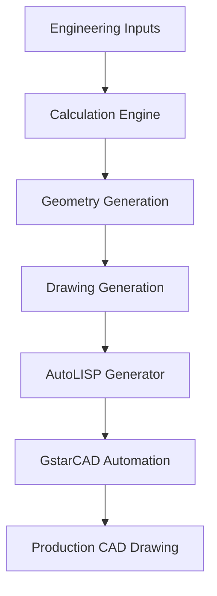
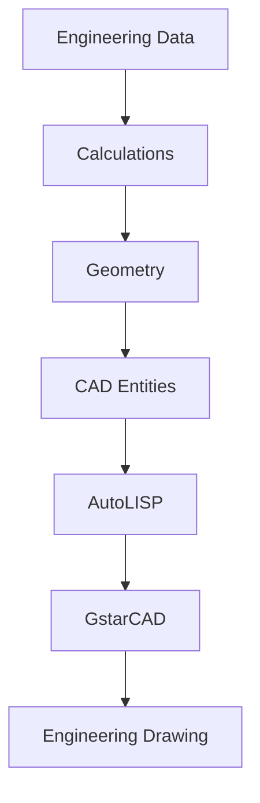

<div align="center">

# MEGA Engineering Suite

**Professional CAD Automation Software**

Generate production-ready engineering drawings directly from engineering parameters using C#, AutoLISP, and GstarCAD automation.

<br>

[](#)
[](#)
[](#)
[](#)
[](#)
[](#)
[](#)
[](#)

<br>

<div style="border: 1px solid #e1e4e8; padding: 40px; margin: 20px 0; background-color: #f6f8fa; border-radius: 6px;">
  <video src="docs/assets/cad_automation_demo.mp4" width="100%" controls autoplay loop muted></video>
  <br/>
  <p><i>Tube Sheet Generation | Baffle Generation | AutoLISP Automation | Template-Based Drafting</i></p>
</div>

</div>

## Overview

Industrial equipment design traditionally relies on manual CAD drafting, a process that is time-consuming, prone to human error, and difficult to standardize across engineering teams. Generating accurate layouts for tube sheets and baffles requires precise geometric calculations and iterative positioning.

MEGA Engineering Suite addresses this engineering problem by replacing manual drafting with programmatic generation. By entering strict engineering parameters into the suite, the application computes the required geometry, resolves spatial constraints, and generates deterministic AutoLISP scripts. These scripts directly interface with GstarCAD (or AutoCAD) to output standardized, production-ready engineering drawings in seconds. The modular architecture ensures that new equipment types and layout variations can be seamlessly integrated into the existing workflow.

---

## Features

| Feature | Description |
| --- | --- |
| Parametric CAD Generation | Automatically generates drawings from engineering parameters |
| AutoLISP Automation | Produces complete drafting scripts |
| Template Anchors | Places drawings accurately inside CAD templates |
| Modular Architecture | Supports independent engineering modules |
| Drawing Standardization | Ensures consistent drafting output |

---

## Modules

### TubeSheet Module

| Capability | Status |
| --- | --- |
| Front Tube Sheet | Complete |
| Rear Tube Sheet | Complete |
| Tube Layout | Complete |
| Bolt Hole Generation | Complete |
| Partition Plates | Complete |
| Side Views | Complete |
| Dimensioning | Complete |
| Annotation Placement | Complete |
| Bonnet Flange Integration | Complete |
| Title Block Attribute Mapping | Complete |

### Baffle Module

| Capability | Status |
| --- | --- |
| Top Cut Baffle | Complete |
| Bottom Cut Baffle | Complete |
| Dynamic Cut Geometry | Complete |
| Tube Clearance | Complete |
| Automatic Dimensions | Complete |
| Layer Management | Complete |
| Leader Generation | Complete |
| Annotation Engine | Complete |

### Flange Module

| Capability | Status |
| --- | --- |
| Body Flange (Bonnet) | Complete |
| Dimensional Lookups | Complete |
| GstarCAD COM Automation | Complete |
| Title Block Extraction | Complete |

---

## Architecture



---

## Technology Stack

| Technology | Purpose |
| --- | --- |
| C# | Desktop application |
| .NET | Framework |
| Windows Forms | User Interface |
| AutoLISP | CAD automation |
| GstarCAD | CAD platform |
| Python | Utility scripts |

---

## Screenshots

<br>

**Application Dashboard**
> `[ Screenshot Placeholder ]`

<br>

**Tube Sheet Module**
> `[ Screenshot Placeholder ]`

<br>

**Baffle Module**
> `[ Screenshot Placeholder ]`

<br>

**Generated Engineering Drawing**
> `[ Screenshot Placeholder ]`

---

## Workflow



---

## Repository Structure

```text
MEGA Engineering Suite
│
├── Modules
│   ├── TubeSheet
│   ├── Baffle
│   ├── Flange
│   └── Tank
│
├── Geometry
│
├── CalculationEngine
│
├── DrawingAutomation
│
├── Templates
│
└── Resources
```

---

## Future Roadmap

| Module | Status |
| --- | --- |
| TubeSheet | Complete |
| Baffle | Complete |
| Flange | Complete |
| Nozzle | Planned |
| Pipe Support | Planned |
| Tank | Planned |
| BOM Generation | Planned |
| Report Generation | Planned |
| Multi-CAD Support | Planned |
| REST API | Planned |

---

## Documentation

| Document | Description |
| --- | --- |
| Installation | Setup instructions |
| Architecture | Internal design |
| Modules | Available automation modules |
| Development | Contributor guide |
| License | Project license |

---

<div align="center">
  
**MEGA Engineering Suite**

Developed by **MEGA Engineering Projects Pvt. Ltd.**

Professional CAD Automation for Process Equipment Design

</div>
