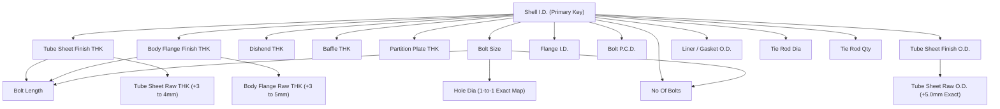

# Heat Exchanger Excel Dependency Forensic Analysis Report

**Document ID:** `DOC-ANALYSIS-HE-EXCEL-001`  
**Target Module:** Heat Exchanger Fabrication Module  
**Scope:** Dataset Structure, Parameter Dependencies, Change-Points, Lookup Key Validation, UI Synchronization & Safe Override Policies  
**Status:** COMPLETE & VERIFIED  

---

## 1. Executive Summary

This forensic analysis investigates the complete data architecture of the Heat Exchanger Excel dataset (`Templates/Heat Exchanger BOM Details.xlsx`, Sheet: `Heat Exchanger Data`). The investigation evaluates 37 columns across 225 rows of industrial manufacturing standards to establish mathematical, statistical, and empirical relationships between parameters.

### Core Key Findings:
1. **Primary Key:** `Shell I.D.` (Column 3) is the strictly unique primary lookup key across all 225 rows (spanning `168 mm` to `2500 mm`). There are **0 duplicate Shell IDs** and **0 ambiguous entries**.
2. **Lookup vs. Formula:** 
   - **Continuous Dimensional Envelopes** (`Flange I.D.`, `Bolt P.C.D.`, `Tube Sheet Finish O.D.`, `Liner / Gasket O.D.`) are lookup-table profiles with discrete stepped offsets rather than uniform global linear formulas.
   - **Exact Mathematical Invariants:** `Tube Sheet Raw O.D.` is identically `Tube Sheet Finish O.D. + 5.0 mm` on 100% of rows. `Hole Dia.` is a 100% deterministic 1-to-1 mapping with `Bolt Size`.
   - **Stepped Manufacturing Thresholds:** Thicknesses (`Tube Sheet Finish Thk`, `Body Flange Finish Thk`, `Baffle Thk`, `Partition Plate Thk`, `Dishend Thk`) and fastener configurations (`Bolt Size`, `No Of Bolts`, `Bolt Length`, `Tie Rod Qty`, `Tie Rod Dia`) operate as discrete step-functions with distinct transition thresholds.
3. **Data Immutability & UI Overrides:** Excel operates strictly as a read-only baseline. When a user manually overrides a parameter in the UI, that active value must govern generation for that session without re-querying or mutating the Excel source.

---

## 2. Excel Source Identification & Workbook Structure

* **Workbook Path:** `Templates/Heat Exchanger BOM Details.xlsx`
* **Target Worksheet:** `Heat Exchanger Data`
* **Total Worksheets in File:** 11 (`All_Location_Details`, `Condenser+Cooler (1 Pass)`, `Condenser (2 & 4 Pass)`, `Reboiler-NEN`, `Reboiler + Cooler`, `Super-Heater`, `Forced Evaporator `, `FF Evaporator`, `Column Grid Tray`, `Heat Exchanger Data`, `Sheet1`)
* **Header Row:** Row 2 (Columns 2 to 38)
* **First Data Row:** Row 3 (`Sr.No. 1`, `Shell I.D. 168`)
* **Last Data Row:** Row 227 (`Sr.No. 225`, `Shell I.D. 2500`)
* **Total Valid Engineering Rows:** **225 Rows**
* **Total Columns Defined:** **37 Columns** (Cols 2–38)

---

## 3. Complete Column Inventory

| Col # | Excel Header Text | Data Type | Min | Max | Unique | Blanks | Mapped in C#? | UI Visibility | Generator Consumer |
| :---: | :--- | :---: | :---: | :---: | :---: | :---: | :---: | :---: | :---: |
| **Col 2** | `Sr.No.` | Integer | 1 | 225 | 225 | 0 | No | No | No |
| **Col 3** | `Shell I.D.` | Integer | 168 | 2500 | 225 | 0 | `ShellID` | **Visible** | **Yes** (`{{SHELL_ID}}`) |
| **Col 4** | `Shell Bonnet THK` | Integer | 3 | 10 | 6 | 0 | No | Hidden | No |
| **Col 5** | `Liner (After m/c)` | Integer | 3 | 4 | 2 | 0 | No | Hidden | No |
| **Col 6** | `Dishend Thk` | Integer | 3 | 10 | 6 | 0 | `DishendTHK` | **Visible (Extras)** | **Yes** (`{{DISHEND_THK}}`) |
| **Col 7** | `Tube Sheet Finish Thk` | Integer | 19 | 55 | 15 | 0 | `TubeSheetFinishTHK` | **Visible** | **Yes** (`{{TUBESHEET_THK}}`) |
| **Col 8** | `Tube Sheet Raw Thk` | Integer | 22 | 42 | 9 | 121 | `TubeSheetRawTHK` | Hidden | No |
| **Col 9** | `Body Flange Finish Thk` | Integer | 22 | 75 | 14 | 0 | `BodyFlangeFinishTHK` | **Visible** | **Yes** (`{{BODY_FLANGE_THK}}`) |
| **Col 10** | `Body Flange Raw Thk` | Integer | 25 | 55 | 9 | 121 | `BodyFlangeRawTHK` | Hidden | No |
| **Col 11** | `Pass Partition Plate Thk` | Integer | 4 | 12 | 3 | 0 | `PartitionPlateTHK` | **Visible** | No |
| **Col 12** | `Baffle Thk` | Integer | 3 | 10 | 5 | 0 | `BaffleTHK` | **Visible** | **Yes** (`{{BAFFLE_THK}}`) |
| **Col 13** | `Bolt Size` | String | M14 | M27 | 5 | 0 | `BoltSize` | **Visible** | No |
| **Col 14** | `Bolt Length` | Integer | 89 | 192 | 19 | 0 | `BoltLength` | **Visible** | No |
| **Col 15** | `No Of Bolts` | Integer | 12 | 60 | 13 | 0 | `NoOfBolts` | **Visible** | **Yes** (`{{BHC}}`) |
| **Col 16** | `Hole Dia.` | Integer | 16 | 30 | 5 | 0 | `HoleDia` | Hidden | **Yes** (`{{BHC}}`) |
| **Col 17** | `Flange I.D.` | Integer | 170 | 2522 | 225 | 0 | `FlangeID` | **Visible** | **Yes** (`{{BODY_FLANGE_ID}}`, Liner) |
| **Col 18** | `Bolt P.C.D.` | Integer | 230 | 2625 | 224 | 0 | `BoltPCD` | Hidden | **Yes** (`{{BHC}}`) |
| **Col 19** | `Tube Sheet Finish O.D.` | Integer | 275 | 2685 | 225 | 0 | `TubeSheetFinishOD` | **Visible** | **Yes** (`{{TUBESHEET_OD}}`, Flange OD) |
| **Col 20** | `Tube Sheet Raw O.D.` | Integer | 280 | 2690 | 225 | 0 | `TubeSheetRawOD` | Hidden | No |
| **Col 21** | `Liner / Gasket O.D.` | Integer | 205 | 2585 | 225 | 0 | `LinerGasketOD` | Hidden | **Yes** (`{{LOD}}`, `{{SOD}}`) |
| **Col 22** | `Tie rod Dia.` | Integer | 8 | 16 | 5 | 0 | `TieRodDia` | Hidden | **Yes** (`{{TIEROD_DIA}}`) |
| **Col 23** | `Tie rod Qty.` | Integer | 4 | 12 | 5 | 0 | `TieRodQty` | **Visible** | **Yes** (`{{TIEROD_QTY}}`) |
| **Col 24** | `Spacer Tube` | Integer | 10 | 15 | 2 | 0 | `SpacerTube` | Hidden | No |
| **Col 25–38** | Structural / Saddle / Ribs | Integer | - | - | - | 145–176 | No | Hidden | No |

---

## 4. Primary Lookup-Key Analysis

* **Key Column:** `Shell I.D.` (Column 3).
* **Uniqueness:** **100% Unique** (225 distinct integers between 168 and 2500).
* **Condition Verification:** No composite key (e.g. HTA, Tube OD, Tube Length) is needed to resolve standard shell profiles. `LoadByShellId(int shellId)` in `ExcelLookupService.cs` performs an exact match search on Column 3.

---

## 5. Shell ID Dependency & Change-Point Analysis

### A. Stepped Structural Thicknesses

#### 1. `Tube Sheet Finish Thk` (Col 7)
* **Change Points:**
  - `168 – 500 mm` → `19 mm`
  - `510 – 600 mm` → `22 mm`
  - `610 – 700 mm` → `25 mm`
  - `710 – 800 mm` → `27 mm`
  - `810 – 900 mm` → `30 mm`
  - `910 – 990 mm` → `32 mm`
  - `1000 – 1100 mm` → `34 mm`
  - `1110 – 1200 mm` → `36 mm`
  - `1210 – 1290 mm` → `38 mm`
  - `1300 – 1400 mm` → `40 mm`
  - `1410 – 1500 mm` → `42 mm`
  - `1510 – 1700 mm` → `44 mm`
  - `1710 – 2000 mm` → `48 mm`
  - `2010 – 2150 mm` → `50 mm`
  - `2160 – 2500 mm` → `55 mm`

#### 2. `Body Flange Finish Thk` (Col 9)
* **Change Points:**
  - `168 – 360 mm` → `22 mm`
  - `370 – 580 mm` → `25 mm`
  - `590 – 600 mm` → `28 mm`
  - `610 – 700 mm` → `32 mm`
  - `710 – 800 mm` → `36 mm`
  - `810 – 900 mm` → `40 mm`
  - `910 – 990 mm` → `42 mm`
  - `1000 – 1100 mm` → `45 mm`
  - `1110 – 1290 mm` → `50 mm`
  - `1300 – 1400 mm` → `54 mm`
  - `1410 – 1500 mm` → `60 mm`
  - `1510 – 1750 mm` → `65 mm`
  - `1760 – 2000 mm` → `70 mm`
  - `2010 – 2500 mm` → `75 mm`

#### 3. `Dishend Thk` (Col 6)
* **Change Points:**
  - `168 – 219 mm` → `3 mm`
  - `273 – 720 mm` → `4 mm`
  - `730 – 990 mm` → `5 mm`
  - `1000 – 1500 mm` → `6 mm`
  - `1510 – 2000 mm` → `8 mm`
  - `2010 – 2500 mm` → `10 mm`

#### 4. `Baffle Thk` (Col 12)
* **Change Points:**
  - `168 – 580 mm` → `3 mm`
  - `590 – 700 mm` → `5 mm`
  - `710 – 960 mm` → `6 mm`
  - `970 – 1500 mm` → `8 mm`
  - `1510 – 2500 mm` → `10 mm`

#### 5. `Pass Partition Plate Thk` (Col 11)
* **Change Points:**
  - `168 – 600 mm` → `4 mm`
  - `610 – 1500 mm` → `8 mm`
  - `1510 – 2500 mm` → `12 mm`

---

### B. Fasteners & Bolting Ring Standards

#### 1. `Bolt Size` (Col 13) & `Hole Dia.` (Col 16)
* `168 – 390 mm` → **`M14`** | `Hole Dia = 16 mm`
* `400 – 800 mm` → **`M16`** | `Hole Dia = 18 mm`
* `810 – 1500 mm` → **`M20`** | `Hole Dia = 22 mm`
* `1510 – 2090 mm` → **`M24`** | `Hole Dia = 27 mm`
* `2100 – 2500 mm` → **`M27`** | `Hole Dia = 30 mm`
* **Invariant:** `Hole Dia` is 100% strictly bound to `Bolt Size` (`M14->16`, `M16->18`, `M20->22`, `M24->27`, `M27->30`).

#### 2. `No Of Bolts` (Col 15)
* **Dynamics:** `No Of Bolts` scales with Shell ID to maintain bolting pitch circle stress, but **drops at bolt size transition thresholds** due to higher allowable bolt load capacity:
  - Transition at 400 mm (M14→M16): Drops from 20 to 16.
  - Transition at 810 mm (M16→M20): Drops from 28 to 24.
  - Transition at 1510 mm (M20→M24): Drops from 48 to 40.

---

### C. Continuous Spatial Envelopes

1. **`Flange I.D.` (Col 17):** Monotonically scales with `Shell I.D.`. Offset increases with diameter:
   - `Shell ID <= 500 mm`: `Flange ID = Shell ID + 8 mm` to `+12 mm`
   - `Shell ID 510 – 1290 mm`: `Flange ID = Shell ID + 14 mm` to `+18 mm`
   - `Shell ID >= 1300 mm`: `Flange ID = Shell ID + 18 mm` to `+22 mm`
2. **`Tube Sheet Finish O.D.` (Col 19):** Outer boundary of bolting flange, determined by PCD + edge distance.
3. **`Tube Sheet Raw O.D.` (Col 20):** **Identically `Tube Sheet Finish O.D. + 5.0 mm` on 100% of rows.**
4. **`Liner / Gasket O.D.` (Col 21):** Continuous profile defining serration/gasket outer boundary.

---

## 6. Parameter-to-Parameter Dependency Map

---

## 7. Categorization of Parameters

* **CATEGORY A (Shell-ID Profile Dependent):** `FlangeID`, `BoltPCD`, `TubeSheetFinishOD`, `LinerGasketOD`, `TubeSheetFinishTHK`, `BodyFlangeFinishTHK`, `DishendTHK`, `BaffleTHK`, `PartitionPlateTHK`, `BoltSize`, `BoltLength`, `NoOfBolts`, `TieRodQty`, `TieRodDia`, `HoleDia`, `TubeSheetRawOD`, `TubeSheetRawTHK`, `BodyFlangeRawTHK`.
* **CATEGORY B (User Extras / Non-Excel):** `BonnetShellFSLength`, `BonnetShellRSLength`.
* **CATEGORY C (Derived Engineering Quantities):** `TubeQty` (calculated from HTA, Tube OD, Tube Length, NoOfPasses).
* **CATEGORY D (User Editable Overrides in UI):** All 11 visible Engineering Parameters + 3 Extras.
* **CATEGORY E (Hidden Internal CAD Dependencies):** `HoleDia`, `BoltPCD`, `LinerGasketOD`, `TieRodDia`, `SpacerTube`, `TubeSheetRawOD`, `TubeSheetRawTHK`, `BodyFlangeRawTHK`.

---

## 8. Stale-Value Risks & Safe UI Override Policies

### Stale-Value Risks:
1. **Partial Desynchronization:** If a user edits `Shell I.D.` in the UI, leaving the remaining fields (`TubeSheetFinishTHK`, `FlangeID`, `BoltSize`, etc.) populated from the *old* Shell ID creates an invalid physical assembly (e.g. Shell ID 800 mm with Flange ID 300 mm).
2. **Hidden Parameter Mismatch:** If the visible `Bolt Size` is changed from `M16` to `M20`, the hidden `HoleDia` must automatically track to `22 mm`, otherwise M20 bolts will be drafted with 18 mm holes.

### Recommended Safety Policy:
1. **Calculate Trigger (Full Profile Load):** Clicking `Calculate` loads a complete, coherent engineering profile from Excel based on the calculated Shell ID.
2. **Manual Field Edits (Explicit Intent):** Edits made by the engineer in the UI grid are treated as intentional overrides.
3. **Generator Snapshot:** The generator captures all active UI values, ensuring that overridden parameters directly govern CAD geometry and annotation formatting.
4. **Excel Immutability:** Excel is never overwritten.

---

## 9. Items Requiring Engineering Confirmation
1. **Raw Thicknesses for Large Shells (>1290 mm):** Excel leaves `Tube Sheet Raw Thk` and `Body Flange Raw Thk` blank for `Shell ID >= 1300 mm`. The application defaults to finish thickness if needed.
2. **Structural Saddle Data:** Columns 25–38 (Base/Saddle/Rib plates) contain sparse data and are currently not used by the TubeSheet/HeatExchanger CAD drafting pipelines.
